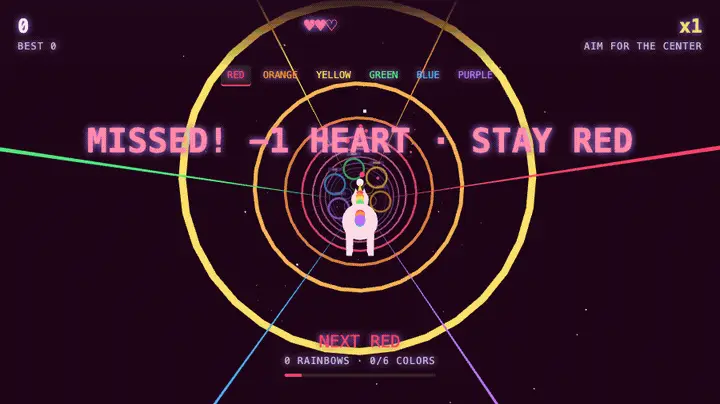

[](https://js13kgames.com/)
[](https://github.com/features/copilot)


Created for [js13kGames](https://js13kgames.com/) competition.
**Theme:** Rainbows and Unicorns. **Constraint:** web only, <= 13KB.

# Rainbow Unicorn Run

<p align="center">
  <a href="index.html">
    
  </a>
</p>

Fly a unicorn through a neon tunnel, chase glowing rings in rainbow order, and turn precise flying into a high-score streak. Faster starts, changing routes, and instant replay make the next rainbow tempting.

### [🌈 Play now →](index.html)

Download and open `index.html` in a modern browser, or serve it locally using the commands below. The link above points to the game file; no hosted demo is configured.

**Controls:** Mouse, <kbd>W</kbd> <kbd>A</kbd> <kbd>S</kbd> <kbd>D</kbd>, or arrow keys to steer · <kbd>Space</kbd> or **Let's Fly / Play Again** to start or replay after a run. Holding Space does not repeatedly restart. Center a highlighted ring on the aiming dot; keyboard steering holds its destination when released.

**VR:** On compatible WebXR browsers and headsets, serve over HTTPS or localhost and select **Enter VR**. Look to steer; use the headset's select action or look at the circular target for a moment to start/replay. An in-headset HUD shows the active cue, score, best, hearts, and perfect chain.

## Features

- **Find your flow:** start at speed 22, with the first ring row about 0.82 seconds away. Each completed rainbow builds toward speed 30, while wider gaps between rows keep the color choices readable. Clockwise or counterclockwise routes vary each run; gentle arcs, zigzags, and narrow/wide layouts replace random shuffles and spinning targets.
- **Read the route:** actionable rings have bright outer halos and color-name labels. The HUD shows rainbow progress and an approaching-row meter. Every row gets a visible and, where supported, spoken cue; after one to five single-color cues, an occasional **“Not COLOR”** cue makes every other color valid.
- **Make precision pay:** perfect hits, three-hit chain bonuses, rainbow celebrations, short musical cues, and compact particle bursts reward good flying. The initial row is announced at the start, and exactly one fresh cue follows every non-terminal crossing.
- **Chase your best:** a local best score survives reloads when browser storage is available. End-of-run results show score, best/new best, completed rainbows, and perfect hits, with one-button replay.

## Rules and scoring

Progress through **red → orange → yellow → green → blue → purple**, then repeat. A normal cue accepts only its named color. A **“Not COLOR”** cue accepts any of the other five rings; that valid hit completes the current rainbow step once.

| Result | Reward / penalty |
| --- | --- |
| Valid ring for the active cue | `100 × current multiplier`, then increase the multiplier by one |
| PERFECT (within 0.40 units of the center) | An extra `50 × current multiplier`, using the multiplier **before** it increases |
| Every third consecutive PERFECT | Another **300 points**, included in the displayed total |
| Ordinary correct hit | Keeps the score multiplier, but breaks the perfect chain |
| Wrong color **or missed row** | Lose one heart; reset the multiplier to x1 and the perfect chain to zero |

You have **three hearts**. A miss is no longer free: flying between rings costs a heart, just like the wrong color. After either mistake, your required color stays the same, and a brief recovery slowdown helps you get back on route. Three mistakes end the run; passed rows cannot score twice.

Each completed rainbow increases speed by 1.25, capped at 30, while row spacing gradually settles from 26 to 24.8. Regular decisions remain approximately **0.83–1.18 seconds apart**, keeping colors more separated even as the pace increases. Mistakes add a short breather. The collision radius remains below one unit; the glowing outer halo is a guide, not an enlarged hitbox.

Best scores are stored only in this browser/origin. Blocked storage or malformed saved scores show a nonfatal warning; the game remains playable, but saving may be unavailable.

## Development

Requires a modern browser with WebGL and an internet connection to load Three.js from unpkg. No dependency installation or compilation is needed. The optional local server uses Python 3; packaging uses the `zip` command. Automated tests use Node.js 18+ and its built-in test runner, without packages.

```sh
# Run locally, then open http://localhost:8000
python3 -m http.server 8000

# Exercise the actual dependency-free gameplay core embedded in index.html
node --test tests/gameplay.mjs

# Package the game from a separate terminal
zip -9 submission.zip index.html
wc -c index.html submission.zip
```

Package output: `submission.zip`.

The **compressed, one-file ZIP** targets ≤13,000 bytes; readable source HTML is larger. Only `index.html` belongs in the game archive—tests and documentation are development files.

The current game imports Three.js from a CDN, so this archive is not self-contained and requires network access. Meeting the ZIP-size target is **not** a claim that the game meets all competition submission rules.

Tests cover reset, scoring, precision thresholds, misses, game over, deterministic cue countdowns and negative-color selection, production cue presentation/speech wiring, interpolated crossings, storage failures, replay-key rules, layout bounds, and real keyboard smoothing at 30/60/120 Hz. Seeded simulations include long streaks, all wrong-color transitions, and recovery from steering-limit corners. Desktop browser checks cover start/replay, keyboard/mouse input, feedback, saved-score reload, and resize. WebXR remains supported, but headset behavior requires testing on actual hardware.

## Contributing

Contributions welcome! This was a short-lived competition project, so ongoing
maintenance isn't guaranteed. Feel free to fork it and make it your own.

## License

MIT (a `LICENSE` file has not yet been added to this repository).
