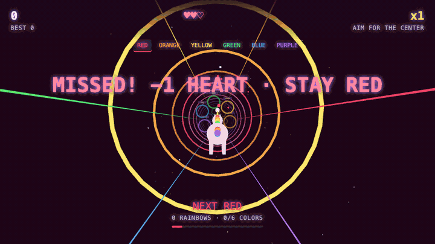

[](https://js13kgames.com/)
[](https://github.com/features/copilot)


Created for [js13kGames](https://js13kgames.com/) competition.
**Theme:** Rainbows and Unicorns. **Constraint:** web only, <= 13KB.

# Rainbow Unicorn Run

<p align="center">
  <a href="index.html">
    
  </a>
</p>

Fly a unicorn through a neon tunnel, chase rings in rainbow order, and keep your streak alive as the world races faster.

### [🌈 Play now →](index.html)

Download and open `index.html` in a modern browser, or serve it locally using the commands below. The link above points to the game file; no hosted demo is configured.

<!-- Add a gameplay recording when assets/gameplay.gif is available:

-->

**Controls:** Mouse, <kbd>W</kbd> <kbd>A</kbd> <kbd>S</kbd> <kbd>D</kbd>, or arrow keys to steer · <kbd>Space</kbd> or **Start** to play or restart

**VR:** On compatible WebXR browsers and headsets, serve over HTTPS or localhost and select **Enter VR**. Look to steer; look at the circular target to start or restart.

## Features

- Collect rings in rainbow order, from red to purple. Wrong colors cost a heart; three mistakes end the run.
- Fly through a glowing 3D tunnel with a rainbow-maned unicorn, particle trails, synthesized sound effects, and spoken color cues where supported.
- Build a score multiplier with correct rings, then face faster flight and tighter ring spacing with every completed rainbow.

## Development

Requires a modern browser with WebGL and an internet connection to load Three.js from unpkg. No dependency installation or compilation is needed. The optional local server uses Python 3; packaging uses the `zip` command.

```sh
# Run locally, then open http://localhost:8000
python3 -m http.server 8000

# Package the game from a separate terminal
zip -9 submission.zip index.html
```

Package output: `submission.zip`.

The current game imports Three.js from a CDN, so this archive is not self-contained. The 13KB limit is the competition target, not a claim that the current game meets all submission rules.

## Contributing

Contributions welcome! This was a short-lived competition project, so ongoing
maintenance isn't guaranteed. Feel free to fork it and make it your own.

## License

MIT (a `LICENSE` file has not yet been added to this repository).
